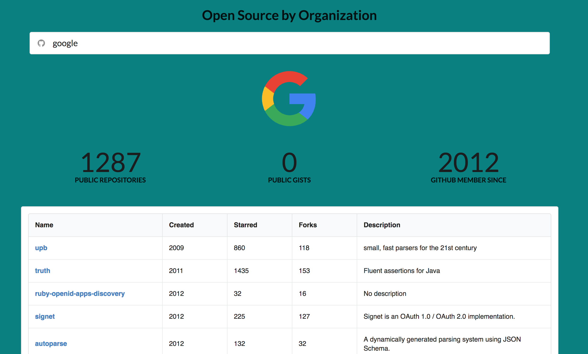

#Seeing the Open Source World

# Welcome to _Open World_

[Deployed Website on Heroku](https://open-world-repos.herokuapp.com)

[Hackathon Presentation - Youtube](https://youtu.be/RZdFeJjzzZQ)

Open World is a search engine for registered Github Organizations.

## Screenshots

## Background

* The genesis of this search engine came from desires to

* Front-end: React, Redux, Semantic UI
* Back-end: Node.js, Express, Passport, PostgreSQL

## Running App Locally

To run this application locally, `git clone` this to your file system directory. Then don't forget to `npm install`. Once all dependencies are install, start the server by `npm run start-dev`.

##Further insights to uncover
1. Repos that are licensed to be open source
2. Open source contributions by programming languages
