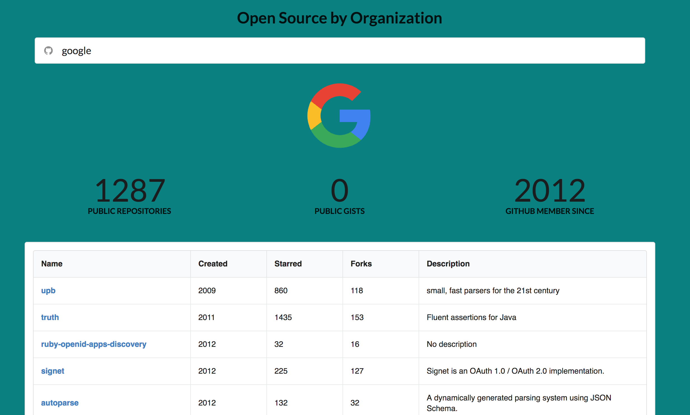
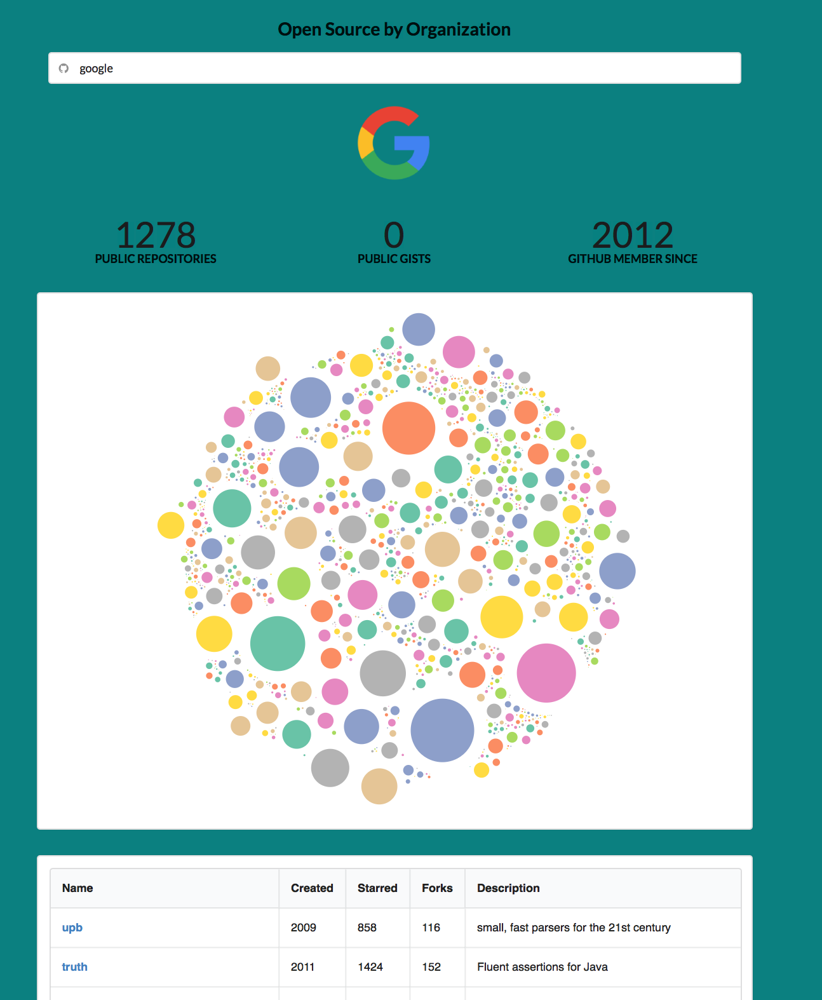

# _Open World_ - A search engine for registered Github organizations

[Deployed Website on Heroku](https://open-world-repos.herokuapp.com)

[Hackathon Presentation - Youtube](https://youtu.be/RZdFeJjzzZQ)

## Background

* The genesis of this search engine came from desires to quickly see the impact of an organization's contribution to the open source community. This can be uncovered by determining how many public repos are dependent on a particular open source repository.

* Defintion for "Open Source" by [Github Help](https://help.github.com/articles/licensing-a-repository/) - Public repositories on GitHub are often used to share open source software. For your repository to truly be open source, you'll need to license it so that others are free to use, change, and distribute the software.

* Front-end: React, Redux, Semantic UI
* Back-end: Node.js, Express, Passport, PostgreSQL

## Screenshot

## Running App Locally

To run this application locally, `git clone` this to your file system directory. Then don't forget to `npm install`. Once all dependencies are install, start the server by `npm run start-dev`.

## Further insights to represent in application
1. Repos that are licensed to be open source
2. Open source contributions by programming languages
3. Number of public repos depending on a particular open source project

## Work in Progress

While I have successfully rendered D3 bubble visuals to the DOM, I have not added a tooltip to indicate the repository each bubble represents. More to come!

